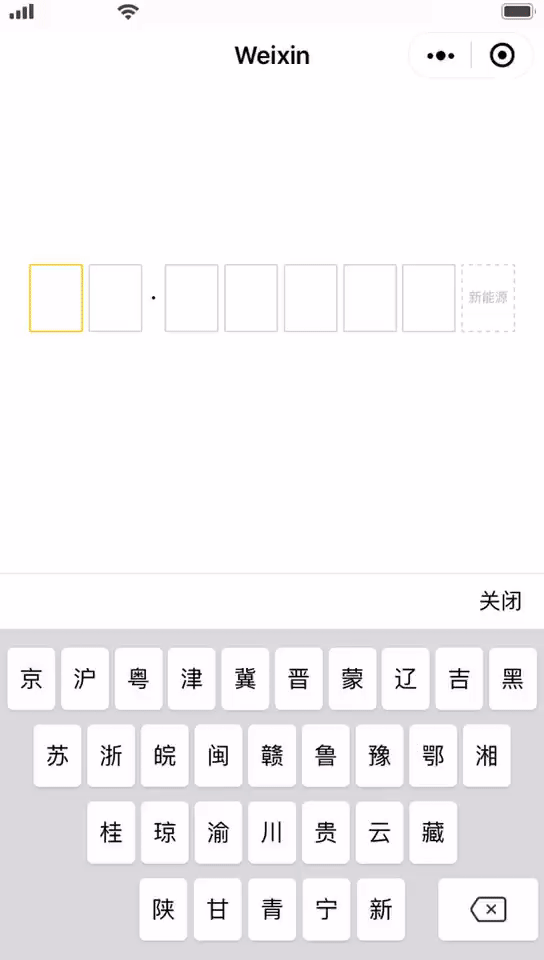

####
------------
###微信小程序车牌键盘

整体效果示例



###使用方式

json文件配置：在需要引用的页面json文件中配置,其中的plate名字可自定义，路径填写实际路径

```
{
  "usingComponents": {
    "plate" : "/components/plate/plate"
  }
}
```

wxml文件引入：plate标签是json文件自定义的对应名字

```
<plate id='plate'
	isShow="{{isShow}}"
	keyBoardInputIndex="{{current_index}}"
	bind:deleteWord="_deleteWord"
	bind:clickWord="_clickWord">
</plate>
```


属性

|  属性名称   | 类型  | 默认值 | 说明 |
|  ----  | ----  | ---- | ---- | 
| isShow  | 	布尔(boolean) |false | 控制键盘是否显示，true显示，false不显示 |
| current_index  | 数字(Number) | 0 | 表示车牌输入的第几位,为0时是省份简写键盘,为1时是输入地区,大于1时为对应输入键盘

事件

|  事件名称   | 触发情况  | 返回值 |
|  ----  | ----  | ---- |
| deleteWord  | 	删除按钮按下的时候触发 |微信事件 |
| clickWord  | 点击车牌输入按钮时触发 | 微信事件,通过 e.detail.word 取得输入字符 |

------------